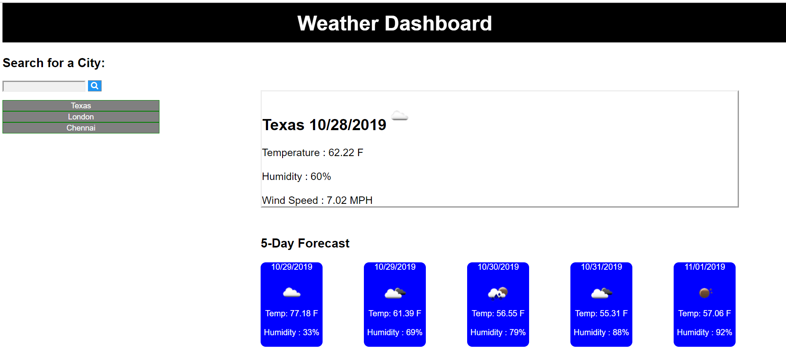

# Homework6

# Project Title
Weather Dashboard - This project covers a weather Dashboard which utilizes the API's to retrieve current weather Information and storing the data effectively in Local Storage. 

# Built With
>Html - UI features  
>CSS - Style sheet  
>jQuery 
>Moment JS 
>Weather API

# Versioning 
> Github

# Screenshots

# Repo Details 
https://github.com/RekhaLeelara/WeatherDash

# Github Pages
https://rekhaleelara.github.io/WeatherDash/Index.html

